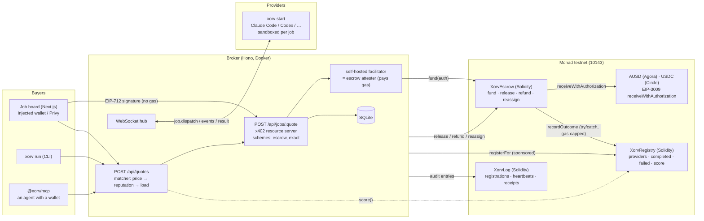

# Architecture

How Xorv on Monad is put together, and why the awkward parts are the way they are.

---

## The shape

```
  buyer                        broker                         provider node
  (app / CLI / MCP)         (services/broker)               (xorv CLI, anywhere)
        │                         │                                  │
        │  1. POST /api/quotes    │                                  │
        ├────────────────────────►│  match: price → on-chain score   │
        │  ◄── quote (pinned)     │                                  │
        │                         │                                  │
        │  2. POST /api/jobs/:q   │                                  │
        ├────────────────────────►│                                  │
        │  ◄── 402 + accepts[]    │  scheme "escrow", payTo = XorvEscrow
        │                         │                                  │
        │  3. PAYMENT-SIGNATURE ─►│  facilitator = escrow attester   │
        │     ReceiveWith-        │  XorvEscrow.fund() ────────────► Monad   
        │     Authorization       │  (buyer → escrow, buyer pays 0 gas)
        │  ◄── 200 + jobId        │                                  │
        │                         ├──── job.dispatch (WebSocket) ───►│
        │  ◄═══ SSE events ═══════╪◄═══ tool calls, edits ═══════════┤
        │  ◄── result             │◄─── answer ──────────────────────┤
        │                         ├── XorvEscrow.release(sha256) ──► escrow → provider
        │                         │        └─ recordOutcome ───────► XorvRegistry         
```

A job that fails is **reassigned** (money stays in escrow, the payee changes) or
**refunded** (money returns to the buyer). A job nobody settles is refundable by
*anyone* once its deadline passes.

### Architecture diagram



---

## Packages

| Package | What it is |
|---|---|
| `contracts/` | Foundry project: `XorvEscrow`, `XorvRegistry`, `XorvLog`, `XorvRefundKeeper`, tests, deploy script. |
| `indexer/` | Envio HyperIndex over all three contracts. |
| `cre/` | Chainlink CRE refund-keeper workflow. |
| `packages/agent` | `xorv-agent`: Kimi or Qwen as an autonomous, budgeted buyer. |
| `packages/protocol` | Shared vocabulary: networks, stablecoins, money math, viem plumbing, x402 wiring, the **escrow scheme**. |
| `packages/cli` | `xorv` — the provider node, and the buyer-side `xorv run`. |
| `packages/mcp` | `@xorv/mcp` — Xorv as an MCP server, so an agent can buy capacity. |
| `services/broker` | Registry, matcher, x402 resource server, self-hosted facilitator/attester, audit writer, SQLite. |
| `apps/app` | The job board. |
| `apps/landing` | Marketing. |

---

## Decisions worth explaining

### Escrow, not direct payment

The Hedera and Arc versions paid the provider at the moment of purchase, and
covered a failing provider by reassigning the job "at no extra charge". That
is a promise from the broker, and the buyer had no way to enforce it.

On Monad the money waits in `XorvEscrow` until the work is delivered. There
are exactly three exits — release, refund, reassign — and one of them (refund
after the deadline) needs nobody's permission. The broker can stall; it cannot
keep the money. See `contracts/README.md` for the full property table and the
test that pins each property.

### Why x402 needs a new scheme for this

x402's `exact` EVM scheme signs `TransferWithAuthorization` with a **random**
nonce to an arbitrary `payTo`. Pointing that at an escrow contract would work
mechanically and be unsafe: anyone holding the signature could submit it to the
token directly, landing money in the escrow with no job attached.

The `escrow` scheme (`packages/protocol/src/escrow.ts`) changes two things:

1. It signs **`ReceiveWithAuthorization`**, which the token only executes when
   `msg.sender == to`. The payee is the escrow, so only the escrow can redeem it.
2. The nonce is **derived**, not random:
   `keccak256(abi.encode(TYPEHASH, chainId, escrow, jobId, deadline))`. The
   buyer's one signature commits to the job and its refund deadline on top of
   amount, token and payee. The client recomputes this locally rather than
   trusting the server, and the contract recomputes it on chain.

The payload keeps the `exact` shape (`{authorization, signature}`), and the
broker still offers `exact` alongside `escrow`, so a stock x402 client can pay a
Xorv job — it just doesn't get escrow protection.

### Settlement is two transactions, and that's the point

`fund` happens at payment time (inside the x402 request, so the signed
authorization never outlives its 300-second window). `release` happens when the
result arrives, minutes later, carrying the SHA-256 of the result. The
authorization-expiry problem that forced the old design to pay up front is gone,
because the authorization is consumed at `fund`; what waits is the escrowed
balance, which has its own, longer deadline.

### A quote is a price commitment

x402 asks the server for payment requirements **twice** — once to answer 402,
once to check the payment that comes back. Both answers must name the same
provider, amount, token domain, job id and deadline. So `POST /api/quotes`
freezes all of them, and the escrow `jobId` is `keccak256("xorv:job:" + quoteId)`
— deterministic, so both passes agree without storing anything extra.

### AUSD's domain is not its name

Agora's AUSD answers `name()` with "AUSD" but signs EIP-3009 under the domain
"Agora Dollar" v1; Circle's test USDC on Monad signs under "USDC" v2. x402 fills
the EIP-712 domain automatically only for tokens in its built-in registry, and a
domain read from `name()` would produce a valid signature that verifies against
nothing. The domain is configured per token in
`packages/protocol/src/constants.ts` and was verified by recomputing each
token's `DOMAIN_SEPARATOR`; the fork tests re-check it on every run.

### Reputation is written by the settlement

The registry is written on every settled job: the escrow calls `recordOutcome`
inside `release` / `refund` / `reassign`, gas-capped and wrapped in `try/catch`
so the registry can never block a payment — with an EIP-150 guard so a caller
can't starve the call to skip a provider's bad mark. It started as a Rust
contract on Arbitrum Stylus; Monad has no Stylus, so it is now Solidity with the
same ABI and semantics (its tests mirror the Rust suite).

### History comes from the index, not the RPC

Monad's public RPC answers at most 100 blocks per `eth_getLogs`, about 40
seconds of chain. The broker keeps its own forward index of the audit log
(seeded from transactions it published, then paced at 100 blocks a request),
and everything historical — jobs, receipts, provider records, daily totals — is
indexed by Envio HyperIndex. The CRE refund keeper reads its expired-jobs query.

### Refunds don't depend on the broker

After a job's deadline anyone may refund it, and the money can only go to its
buyer. A Chainlink CRE workflow is that "anyone": it asks the index for funded
jobs past their deadline, confirms each with `isRefundable` on chain, reaches
consensus, and delivers a signed report to `XorvRefundKeeper`, which refunds them.

### Provider nodes dial out

The node opens a WebSocket **to** the broker; the broker never calls in.
Someone sharing a laptop is behind NAT, on hotel wifi, on a machine that sleeps.
Outbound works from all of those with no port forwarding and no inbound attack
surface on their machine.

### Only the operator needs MON

Monad meters gas in MON. The buyer signs typed data and needs none. The
provider is paid by the escrow and needs none — the broker sponsors their
registry entry with `registerFor`. The operator (facilitator + attester) pays
for `fund`, `release` and audit entries; on Monad these cost fractions of a
cent. Monad charges for the gas *limit*, not the gas used, so limits are kept tight.

### Liveness is not a database row

The in-memory registry is on purpose: a provider is only real while heartbeats
keep arriving. What survives goes to SQLite (jobs, payments, escrow state) and
to chain (escrow events, registry reputation, audit log). You do not have to
trust the broker's database: every job's money trail is readable from any RPC.

### Bundlers

`@x402/*` must be in Next.js `serverExternalPackages`. Bundled, they load fine
and then sign *subtly wrong*, and every payment comes back 402 with nothing in
the logs.

---

## Data flow, precisely

**Registration.** Node → `POST /api/providers/register` → in-memory registry
keyed on `nodeId` → bearer token back → `XorvRegistry.registerFor` (sponsored)
and an audit entry. Node opens `wss://…/ws/provider?token=…`.

**Quote.** Matcher walks live providers × capabilities, filters on adapter,
price ceiling and free concurrency, sorts by price, then on-chain reputation
score, then load. The quote freezes provider, price, token, domain, job id and
escrow deadline.

**Payment.** `@x402/hono` wraps `POST /api/jobs/:quoteId`. The facilitator is
in-process: for `escrow` it verifies the signature (ERC-1271 included), the
nonce derivation, balance, allowlist and job uniqueness, then calls
`XorvEscrow.fund`.

**Dispatch.** `job.dispatch` down the socket. The provider runs the adapter in a
fresh sandboxed directory, streams `job.event`, returns `job.result`.

**Settlement.** Result arrives → broker hashes it → `XorvEscrow.release(jobId,
sha256)` → provider paid → registry `completed += 1`. Provider fails → another
live provider: `reassign`; none: `refund` → buyer paid back → registry
`failed += 1`.
